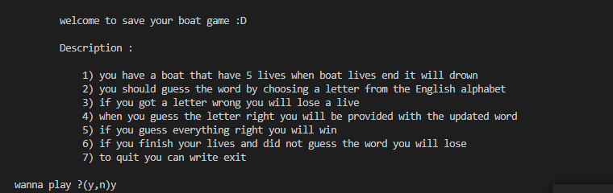
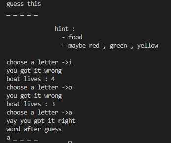

# LAB-01: 

- you are required to make save your boat game 

this game is about to guess a word by writing one letter at a time , you will have a certain amount of lives, when you guess the word right you will save your boat and win, when its end your boat will drawn and you will lose 

## Steps
1. Please follow the below steps as an example.
1. Create a new repo on Github called `401-save-your-boat` , then set it up based on the following structure.

```text

├── save_your_boat.py
├── README.md
├── .venv
├── .gitignore
├── requirements.txt

```
2. Work on a `lab-01` branch.
3. After completing the lab, create a PR from your `lab-01` branch to `main` then merge your code.


## Lab Requirements

- welcoming message , you should have a clear welcoming messsage that contains introduction and game rules  

- ask the user if he want to play or not 


- you should give a user hints

- boat have 5 lives 

- if the player guess the letter wrong he will lose a life and you should tell him how many lives remaining 

- if the player guess the letter right you should give him the updated version of it


- if the player reach to one live you should give him more hints

- if the player guess all the word right you should tell him that he wins 

- player should be able to quit by typing exit

## Submission Instructions

- you should share your pull request link 

- answer the following questions in the comment section 

    1) what is you reflection about the lab 
    2) how much time does it take you to finish the lab

