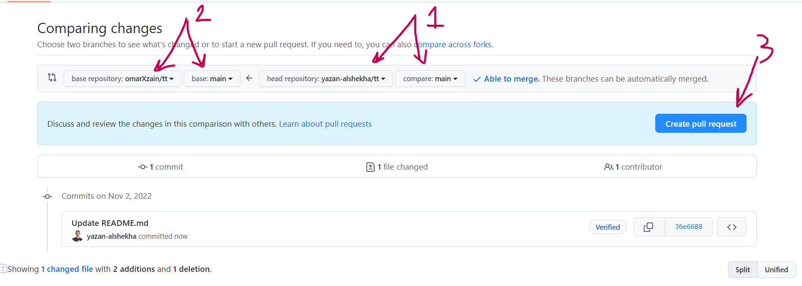

# Pair Programming 
What is the pair programming
it is a driver and a navigator 
1. **driver** is the person who is coding 
2. **navigator** is the person who is helping and monitoring the driver

## Pair Programming Steps:
- the navigator will create a repository `weather-app`
- the driver will go to the navigator GitHub account and go inside "weather-app" and fork it from the button **fork** at the top right of the screen 
- the driver will choose a name for the forked repository (you can name it `driver-forked-weather-app`)
- Click on `create fork`
- then the page will redirect you to `driver-forked-weather-app`
- you need to clone the repository `driver-forked-weather-app` and make sure to work on a separate branch ex `initialize the project`
- ACP your work and open a pull request from `initialize the project` to the main branch 
- now the **driver** work is ready to merge with **navigator** repository
- in the `driver-forked-weather-app` repository, click on the `pull request` tab  then click on the `new pull request` button
- check the following image 

- make sure you are opening a pull request from the `main` branch in the `forked repository` to the `main` branch navigator repository, then click on `create pull request`

## navigator role
- go to your repository `weather-app` click on the `pull requests` tab and merge the `pull request`
- clone the `weather-app` repository and work on it (you become now **driver**)
- work on a separate branch then ACP and merge your branch to the `main` branch 
