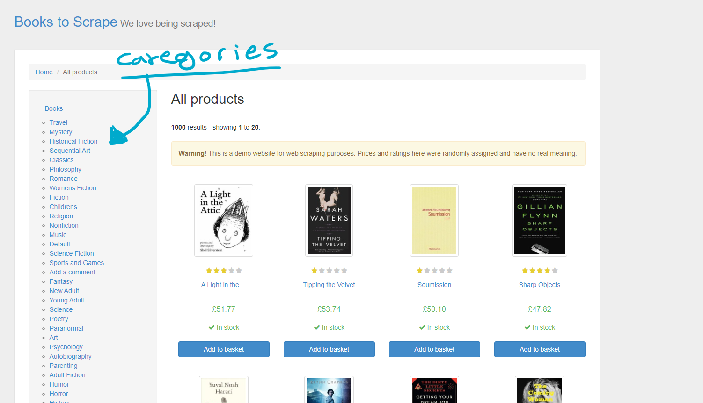

# LAB-01: ًWeb Scraping

- you are reqired to create your own api using webscraping

## Steps
1. Please follow the below steps as an example.
1. Create a new repo on Github called `401-Web-Scraping` , then set it up based on the following structure.
    
```text
├── scrape.py
├── book_api.json
├── .env
├── .gitignore
```

2. Work on a `lab-17` branch.
3. After completing the lab, create a PR from your `lab-17` branch to `main` then merge your code.


## Lab Requirements
- you are required to web scrape this page [books](http://books.toscrape.com/)

- you should choose at least three categories from the left side types 



- you should extact info from each category so you will get this api as a result

**note : save the list of books on data key and each category in type key and make sure that you catch the attributes required from each book** 

```json
[
  {
    "data": [
      {
        "title": "Scott Pilgrim's Precious Little ...",
        "rating": "Five",
        "price": "\u00a352.29",
        "availability": "In stock"
      },
      {
        "title": "Tsubasa: WoRLD CHRoNiCLE 2 ...",
        "rating": "One",
        "price": "\u00a316.28",
        "availability": "In stock"
      },
      .
      .
      .
      {
        "title": "Camp Midnight",
        "rating": "Four",
        "price": "\u00a317.08",
        "availability": "In stock"
      }
    ],
    "type": "Sequential Art"
  },
  .
  .
  .
  ]
```

## Stretch goal

    - rating in the above api is a stretch goal
    
    - you can create a function that finds the count of posts in your api that have a certain rating 


## Submission Instructions

- you should share your pull request link 

- answer the following questions in the comment section 

    1) what is you reflection about the lab 
    2) how much time does it take you to finish the lab
